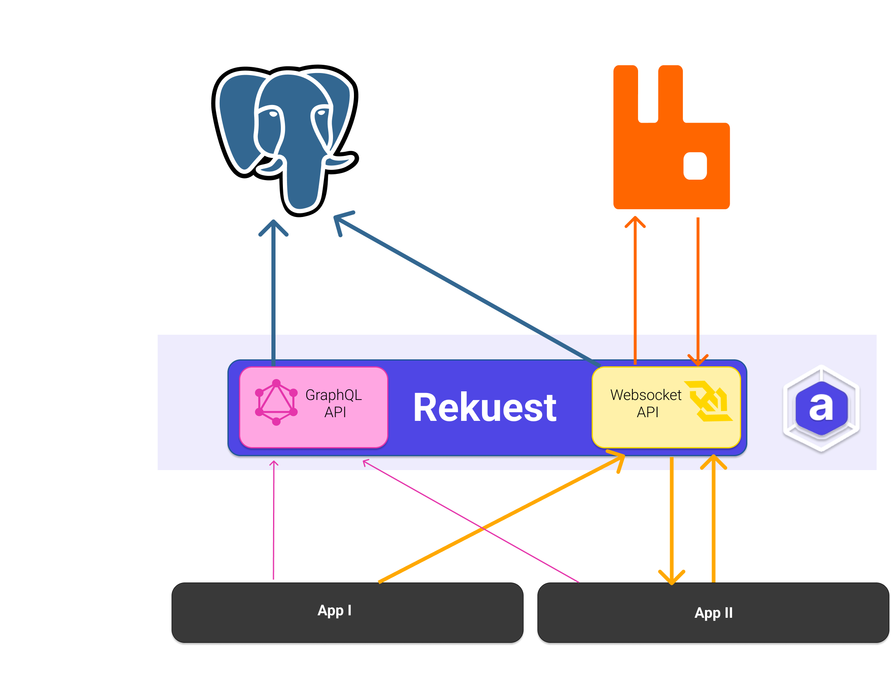

# Rekuest-Server (Next)

[](https://github.com/arkitektio/rekuest-server/)

[](https://github.com/psf/black)


Rekuest is one of the core services of Arkitekt. It represents a central repository of
all the connected apps and their provided functionality, their [Actions](https://arkitekt.live/docs/terminology/actions).
It also provides ways of interacting with the apps, by providing a central access point, that
apps and users can assign tasks to. Rekuest then takes care of routing the requests to the
appropriate app, which executres the task and returns the result to rekuest, which in turn routes it back
to the caller. Similar to all other Arkitekt ervices, Rekuest exposes a GraphQL API, that can be used to interact with it.
You can find the interactive documentation for the API [here](https://arkitekt.live/explorer).

> [!NOTE]  
> What you are currently looking at is the next version of rekuest. It is currently under development and not ready for production. If you are looking for the current version of Rekeust, you can find it [here](https://github.com/arkitektio/rekuest-server).


## Rekuest Design

Rekuest itself is designed as a stateless service (in order to be able to scale horizontally), and
interfaces with proven open-source technologies, such as [Redis](https://redis.io/) and
[PostgreSQL](https://www.postgresql.org/), to route tasks to the appropriate apps. The following
diagram shows the high-level design of Rekuest:



> **📐 Architecture documentation.** For a structured, in-depth explanation of the major elements of
> the service — the Caller/Agent identity model, the relational action-matching engine, the
> realtime layer and higher-order implementations — see **[`docs/design/`](./docs/design/README.md)**.
> The agent protocol, the task lifecycle and workflows are documented with their implementation,
> in [`takt/docs/`](./takt/docs/).

## Two programs, released together

This repository contains two programs. They share one database, one redis and one `config.yaml`,
and are released under the same version.

| program | where | what it does |
|---|---|---|
| **the rekuest server** (Python/Django) | the repository root | GraphQL (queries, mutations, subscriptions), the database migrations, and the two upkeep jobs takt asks it for (service agents, embeddings). |
| **takt** (Rust) | [`takt/`](./takt/README.md) | The whole agent protocol: the agent websocket `/agent`, the HookAgent intake `/agent/http/{agent_id}`, the signal intake `/agent/signal/{service}` (each also under its former name, `/agi`), registration, assign and control, probes, and every sweep (stale agents, deadlines, workflow resume, schedules, triggers, retention). |

The server has no websocket route for agents and no agent code: `rekuest/asgi.py` serves GraphQL
only. Whatever a mutation needs done to a task or an agent, the server asks takt for, through
takt's internal API (`facade/takt.py`), on a listener only the server reaches.

The server owns the schema and migrates it. takt writes the same tables with its own SQL, never
migrates, and waits at startup until the database has the migrations listed in
`takt/schema-migrations.txt`.

## Running it: three processes

| process | command | role |
|---|---|---|
| web (any number of replicas) | `bash run.sh` (daphne) | Migrates on boot, then serves GraphQL and its subscriptions. Runs no loop: takt asks it to provision this hub's services and to embed new actions when those are due. Its health check (`ht`) answers for takt too. |
| takt (any number of replicas) | the `jhnnsrs/rekuest-takt` image, same `config.yaml` | The agent protocol (`agent`, formerly `agi`), every sweep, and the clock of the server's upkeep jobs. Healthcheck: `takt healthcheck`. |

The web process runs from the `jhnnsrs/rekuest` image. Always run the same version of both images.

To run the pair locally from this checkout:

```bash
docker compose up --build
```

[`docker-compose.yaml`](./docker-compose.yaml) starts Postgres, redis, the server
(`http://localhost:8234/graphql`) and takt (`ws://localhost:8235/agent`), both
reading [`config.yaml`](./config.yaml). Tokens are verified against the issuers in that file's
`authentikate` block.

What a deployment has to get right:

- **The pair finds each other by name.** The server reaches takt at `rekuest.takt_url`
  (its internal listener: default `http://takt:8081/<script name>`, or the socket named by `rekuest.takt_socket`), takt reaches the server at `rekuest.server_url`
  (default `http://rekuest:80/<script name>`). Set them where the services are named
  otherwise; while takt is unreachable every assign, control, registration, delete and probe
  is refused and the server's `ht` is unhealthy.
- **The gateway** routes `/<script name>/agent*` and `/<script name>/agi*` to takt and
  everything else to the server, except `/<script name>/_rekuest*`, which it must not route.
- **Hub services** POST their HookAgent reports and signals to takt, so their `rekuest_url`
  points at takt, not at the server.
- **Both read the same `config.yaml`.** takt honours the same `SECTION__KEY` environment
  overrides and `ARKITEKT_CONFIG_FILE` as the server. See [CONFIG.md](./CONFIG.md).

The server holds no state and runs no loop. Every takt replica runs the sweeps and asks the
server for its upkeep jobs; a tick token in redis lets one of them sweep per tick. While no takt runs,
deadlines, schedules and triggers are late, never lost.

## Developmental Notices

Transport is Redis: agent commands travel through a per-agent Redis list that takt drains (chosen
over the Channels layer so a message pushed while an agent is briefly offline survives its
reconnect), and GraphQL subscriptions fan out through `channels_redis`, which takt speaks too. There is no RabbitMQ and no Kafka. To learn more
about this design decision, please refer to the
[Why Not?](https://arkitekt.live/docs/design/why-not) section.

You can find the current developmental action of Rekuest [here](https://github.com/arkitektio/rekuest-server-next)
Efforts from this new repository will be merged into this repository once the new version is ready for production.


