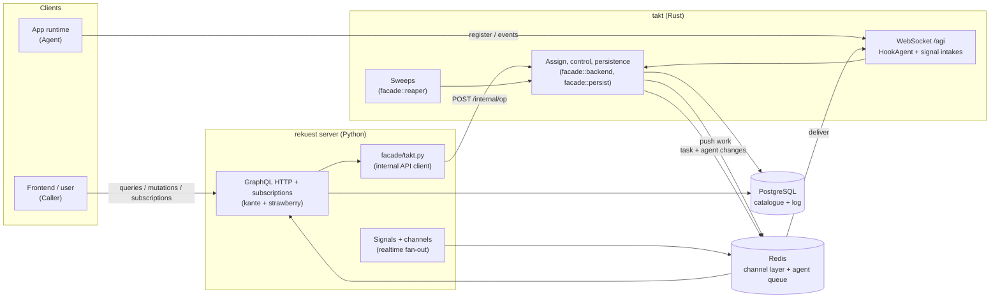

# Rekuest — Design Documentation

This folder is the **authoritative architecture reference** for the `rekuest` service. It explains
*why* the major elements exist and *how* a request flows end-to-end, rather than just listing the
GraphQL surface (see [`../API_DOCUMENTATION.md`](../API_DOCUMENTATION.md) for that) or the dev
workflow (see [`../DEVELOPMENT.md`](../DEVELOPMENT.md)).

> These documents describe the code as it stands today. Where a name recently changed (e.g.
> `Registry` → `Caller`), a short historical note is included so older code still reads sensibly.

> **Two programs.** The rekuest server (Python/Django, the repository root) serves GraphQL, owns
> the schema and its migrations, and runs no loop of its own. **takt** (Rust,
> [`takt/`](../../takt/README.md)) owns the whole agent protocol: agent sockets, the HookAgent
> and signal intakes, registration, assign and control, the task state machine, every sweep
> (deadlines, schedules, triggers, retention) and workflow resume. The server calls takt's
> internal API for everything that writes task state or registrations. The protocol documents are
> in [`takt/docs/`](../../takt/docs/).

## What is Rekuest?

Rekuest is the broker at the centre of the [Arkitekt](https://arkitekt.live) ecosystem. It is a
**GraphQL API (the server) and an agent WebSocket (takt)** that together mediate between two
kinds of participants:

- **Callers** — users and frontend apps that *request* work ("run this action with these args").
- **Agents** — connected runtimes that *provide* implementations and actually *execute* the work.

A caller never talks to an agent directly. A **user** issues an `assign` over GraphQL — the only way
to originate a **root** task, because roots must trace to an accountable human. An **agent** may
assign *dependent* work beneath a task it is running, over the same `/agi` WebSocket it registered on
(`AssignRequest`) or via an HMAC-signed HTTP POST for server-to-server agents. Rekuest resolves which implementation/agent should run it, records a `Task`, pushes
the work to the agent over a WebSocket, persists the events the agent streams back, and re-broadcasts
them to the caller — over a GraphQL subscription **or** as `…Event` mirrors on the same socket.
Rekuest owns the **catalogue** (which actions exist, who can run them, with what data types) and the
**routing + bookkeeping**; it does not run user code itself.

## How the service boots

**The server.** `rekuest/asgi.py` assembles one ASGI application via kante's `router`: GraphQL
over HTTP and its subscriptions over WebSocket, served from `facade.schema.schema` (a
`kante.Schema` with `Query` / `Mutation` / `Subscription` roots). There is no agent route.
`arkitekt-service serve` starts daphne and nothing else; the database is migrated before, by the one-off job
`arkitekt-service run migrate`. The server loads the embedding model at start (management
commands never do) and runs no loop: when takt asks
(`facade/upkeep.py`, a signed internal endpoint), it catalogues this hub's services
(`facade/service_catalog.py`), gives every organization its hook agents
(`facade/hook_agents.py`). Its health check answers for takt too (`rekuest/health.py`).

**takt.** The `takt` binary (`takt/crates/rekuest-server/src/main.rs`) reads the same
`config.yaml`, waits until the database has the migrations it was written against
(`takt/schema-migrations.txt`), and then serves, under the same script-name prefix as the
server (`takt/crates/rekuest-server/src/urls.rs`):

| Route | What it is |
| --- | --- |
| `GET /agent` | the agent WebSocket |
| `POST /agent/http/{agent_id}` | the HookAgent HTTP intake |
| `POST /agent/signal/{service}` | a hub service's signal |
| `/agi`, `/agi/http/…`, `/agi/signal/…` | the same three under their former name |
| `POST /internal/<op>` | the internal API the server calls (`facade/takt.py`) |
| `GET /ht` | health: Postgres and Redis answer |

It also runs the sweeps (`takt/crates/facade/src/reaper.rs`) inside the same process: stale
and disconnected agents, schedules, triggers, due tasks, unpicked tasks, control escalation,
expiry, and retention.

**Between the two.** A gateway routes `<prefix>/agent*` and `<prefix>/agi*` to takt and everything else to the
server. A mutation that assigns, controls, registers or deletes calls
`POST <rekuest.takt_url>/internal/<op>` on takt's internal listener, which only the server
reaches (a unix socket the two mount, or an address of its own); nothing is signed there. A
changed schedule is a Postgres `NOTIFY` in the transaction that writes it. takt publishes task and agent changes on
the same `channels_redis` layer the server's subscriptions listen on.

Configuration is a typed pydantic-settings schema (`rekuest/configuration.py`) loaded from
`config.yaml`, with environment overrides; see [`CONFIG.md`](../../CONFIG.md). The values that
shape runtime behaviour the most:

| Setting | Read by | Role |
| --- | --- | --- |
| `rekuest.takt_url` | server | Where the server reaches takt's internal API. |
| `rekuest.takt_socket` | server | takt's internal listener as a unix socket both mount. |
| `instance.private_key` | both | Signs provenance tokens and takt's upkeep requests to the server. |
| `rekuest.grace_default`, `pickup_deadline`, `disconnected_expiry`, `control_deadline` | takt | The deadlines the sweeps enforce. |
| `rekuest.sweep_interval` | takt | How often takt's sweeps tick. |
| `redis.key_prefix` | both | Namespace of the agent queues and every other redis key. |
| `redis.channel_prefix` | both | The `channels_redis` layer behind the realtime fan-out. |

The heartbeat is not configuration: takt pings an agent every 10 s, waits 5 s for the answer,
and presumes a `connected` agent dead after 30 s without one
(`takt/crates/rekuest-server/src/settings.rs`). The server's `Agent.active` field reads
liveness with the same window (`facade/liveness.py`).

Persistence is PostgreSQL — the relational port-matching engine relies on Postgres-specific
features (`jsonb_path_match`, JSONPath), so Postgres is required in any environment that exercises
action matching.

## Reading order

Start at the top and follow the flow of a request:

1. **[identity.md](identity.md)** — the `(client, user, organization)` triple, and the two
   identities it powers: **Caller** (who asks) and **Agent** (who provides). Read this first;
   everything else references it.
2. **[domain-model.md](domain-model.md)** — the full data model with an ER diagram and the
   uniqueness/cardinality rules that encode the business logic.
3. **[ports.md](ports.md)** — what each `PortKind` means, which of children, identifier and
   choices it carries, how defaults and assignment values are checked, and which widgets fit.
4. **[action-matching.md](action-matching.md)** — how an Action's `provides`/`requires`
   descriptors compile to JSONPath and how the relational port engine finds matching actions.
4. **[task-lifecycle.md](../../takt/docs/task-lifecycle.md)** — `assign`, the
   Task event state machine, and how results flow back to the caller.
5. **[agent-protocol.md](../../takt/docs/agent-protocol.md)** — the WebSocket wire protocol: register, authenticate,
   the liveness lease and its fencing token, task delivery, and connection takeover.
6. **[caller-protocol.md](../../takt/docs/caller-protocol.md)** — sub-assignment on the same socket: how an agent
   assigns *dependent* work (`AssignRequest`), controls its lifecycle
   (cancel/interrupt/pause/resume), and observes results (`…Event` mirrors); plus the HTTP intake.
7. **[realtime.md](realtime.md)** — channels, signals, topic keys, and how subscriptions consume
   them.
8. **[higher-order.md](higher-order.md)** — higher-order implementations (one implementation
   wrapping another) and server-side event unfolding.
9. **[workflows.md](../../takt/docs/workflows.md)** — what happens when an agent dies: a plain task ends `LOST`
   (final; late outcomes kept as `LATE_REPORT`), a `WORKFLOW` is resumed from its journal (keyed
   calls and effects, code pin, resume cap), plus holds and state guards.
10. **[provenance.md](../../takt/docs/provenance.md)** — Rekuest as the provenance authority: the signed
   attestation token minted at dispatch, its claim vocabulary, the human-root invariant, and the
   JWKS endpoint downstream services verify against.

## The one-paragraph mental model

Everything is anchored on the `(client, user, organization)` identity triple derived from the auth
token. A **Caller** is that triple acting as a requestor; an **Agent** is that triple (plus an
app/release/device) acting as a provider. An **Action** is an abstract, versioned function
contract; an **Implementation** binds an Action to an Agent. A caller's `assign` creates an
**Task** (the execution log) stamped with the caller, routed to an agent; the agent streams
**TaskEvents** back, which are persisted and fanned out to the caller's realtime topics
(`root_tasks_caller_{id}` for its own feed, `task_caller_{id}` for the agent-socket mirror). That is
the whole system in miniature; the rest is detail.
