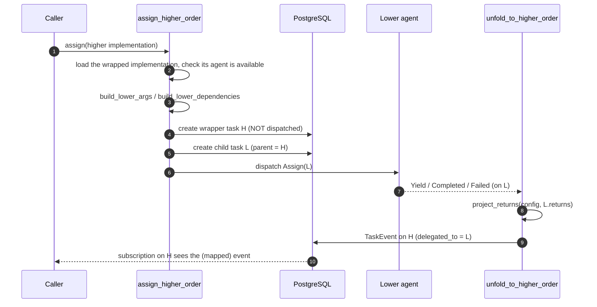

# Higher-Order Implementations

A **higher-order implementation (HOI)** is an implementation that wraps *another* implementation,
remapping its arguments, dependencies and returns. It is how Rekuest expresses partial application
and configuration presets **without** the agents needing any orchestration logic of their own —
Rekuest does the wiring.

The wiring runs in takt. Key files, under `takt/crates/facade/src/`:

- `higher_order.rs` — the pure projection and validation functions.
- `mutations/higher_order.rs` — `create_higher_order_implementation`, behind the
  `createHigherOrderImplementation` mutation (internal route `higher-order/create`).
- `backend.rs` — `assign_higher_order`, the assign path of a wrapper.
- `persist/transitions.rs` — `unfold_to_higher_order` and `project_returns`, the way back.

The model fields are `Implementation.higher_order_for` / `higher_order_config`
(`facade/models/implementation.py`).

## The model

An `Implementation` whose `higher_order_for` points at another implementation is a **wrapper** (`H`)
around a **wrapped/lower** implementation (`L`). The wrapper carries a `higher_order_config` dict
that declares how three channels are projected:

| Channel | Direction | Config keys |
| --- | --- | --- |
| args | caller → `L` | `bound`, `args_key`, `arg_map` |
| dependencies | `H`'s resolved deps → `L` | `dependency_map` |
| returns | `L` → caller | `return_map` |

The projection functions are deliberately **framework-free** (JSON objects in, JSON objects out)
so the remap/unfold contract is unit-testable without a database or the websocket stack.

A wrapper is created with `createHigherOrderImplementation`: the caller supplies the implementation
to wrap (`lower`), the wrapper's `interface`, its typed `definition`, the `config` and the
dependencies it declares. The wrapper is registered **on the agent of the implementation it
wraps**, like a declared implementation (action upsert by hash, port rows, diagnostics), and
linked to the lower in one transaction. Re-registering the agent keeps it: the reap of undeclared
implementations skips wrappers. `deleteImplementation` removes one.

## Two-tier execution: wrapper (virtual) + child (real)

When `assign` resolves a higher-order implementation it calls `assign_higher_order` instead of the
normal path. Two tasks are created, in one transaction:

- **Wrapper task** (`H`) — the user-facing one. It is created with the original caller args
  but is **never sent to an agent**. This is what the caller subscribes to and sees events on.
- **Child task** (`L`) — the real work. Its args/dependencies are projected from the wrapper,
  it is parented to the wrapper (`parent = H`, `root = H.root or H`), flagged
  `is_higher_order_child`, and it **is** dispatched to the agent of the wrapped implementation.

The lower implementation is the one the wrapper points at (`higher_order_for`), not any
implementation of the same action. Its agent must be available at assign time; otherwise the
assign is refused ("Agent for lower implementation … is not available"). A wrapper cannot be
assigned with a future `not_before`.

> **MVP limits:** a wrapper may not wrap another wrapper (no nesting), and wrapper and wrapped action
> `kind`s must agree (a `FUNCTION` wrapper can't wrap a `GENERATOR`, since unfolding is per-yield).
> Both are enforced at creation by `validate_higher_order_pairing`. An implementation cannot
> wrap itself either.

## Projecting arguments inward — `build_lower_args`

`build_lower_args(config, caller_args)` builds `L`'s args with this precedence (later wins on a key
clash):

1. **`bound`** — static params spread as `L`'s named args.
2. **`arg_map`** entries sourced `from: "caller"` — a named caller arg renamed onto an `L` port (and
   marked consumed). A referenced-but-missing caller arg is an error.
3. **Remaining caller args** (those not consumed by an explicit map) — either packed under
   `config["args_key"]` (reified into one dict port) or, if no `args_key`, spread directly by their
   original keys.

## Projecting dependencies inward — `build_lower_dependencies`

`build_lower_dependencies(config, resolved_h_dependencies)` takes the wrapper's *resolved* dependency
object (an explicit, stored contract — see [task-lifecycle.md](../../takt/docs/task-lifecycle.md)) and
projects it onto `L`'s dependency slots:

- **Empty `dependency_map`** → pass-through by matching key.
- **Explicit map** → each lower key is sourced either `from: "bound"` (a static pre-resolved value)
  or `from: "caller"` (one of `H`'s declared dependencies, by key; missing ⇒ error).

`validate_dependency_coverage` checks at creation time that every lower slot is satisfiable and every
caller-sourced reference names a dependency the wrapper actually declares — so the caller knows what
to pass.

## Projecting returns outward — `project_returns`

`project_returns(config, lower_returns)` unfolds `L`'s returns back onto `H`'s return ports:

- `None` returns stay `None`.
- Empty/absent `return_map` → identity (returns passed through unchanged).
- Otherwise `return_map` is `{higher_return_key: lower_return_key}`, rebuilding the object under the
  wrapper's keys.

## Server-side event unfolding

Because the user watches the **wrapper** but the work runs on the **child**, takt re-emits the
child's terminal/yield events onto the wrapper. `unfold_to_higher_order` (called when a report
for the child is persisted, `persist/reports.rs`, and when a sweep ends it, `persist/reconcile.rs`):

1. Returns at once unless the child is flagged `is_higher_order_child`, then finds its `parent`
   and checks the parent's implementation is a wrapper (`higher_order_for_id` is set).
   Other children (hooks, dependency sub-assignments) are ignored.
2. Creates a `TaskEvent` on the **wrapper** with the same `kind`, linked via `delegated_to =
   child`. For `YIELD`, the returns are run through `project_returns` first.
3. On a terminal kind, marks the wrapper done. The write goes through the same row-locked claim
   as every other task transition.

That wrapper event then fans out to the caller's `task_caller_{id}` topic exactly like any other
event ([realtime.md](realtime.md)) — so subscribers see the wrapper complete with mapped returns, as
if it had executed the work directly.

## Why this lives server-side

Putting the remap/unfold in Rekuest (not the agents) means: agents implement only their own concrete
actions; composition, presets and currying are catalogue-level concerns; and the contract is a pure,
testable JSON transformation decoupled from the websocket and the database. The single real
constraint is that the wrapper's resolved dependencies must be an explicit, declared contract — which
`validate_dependency_coverage` enforces up front.
