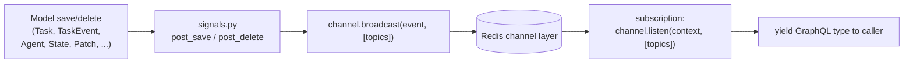

# Realtime: channels, signals & subscriptions

Rekuest pushes live updates to callers over GraphQL subscriptions. The plumbing has three layers:
**channels** (typed pub/sub over Redis), **signals** (Django model hooks that broadcast), and
**subscriptions** (async generators that listen and re-yield). This is separate from the agent
delivery queue — that is point-to-point work delivery; this is fan-out of *observations*.

Key files: `facade/channels.py`, `facade/channel_events.py`, `facade/signals.py`,
`facade/subscriptions/*`.

## The shape of it



A model change fires a Django signal; the signal handler broadcasts a small typed event to one or
more **topic strings**; a subscription that called `listen(...)` on those topics receives the event,
loads the referenced row, and yields it to the subscribed client.

## Channels — typed pub/sub

`facade/channels.py` builds channels with kante's `build_channel(EventModel, name)`. Each channel
carries a specific pydantic payload (`facade/channel_events.py`) — the payloads are intentionally
tiny (mostly just ids), so the subscription re-fetches the current row rather than trusting a
serialized snapshot:

| Channel | Payload | Carries |
| --- | --- | --- |
| `task_event_channel` | `TaskEventCreatedEvent` | `create` (a `TaskChangePayload`) or `event` (a `TaskEventPayload`) |
| `child_task_channel` | `ChildTaskEvent` | `create` / `update` (a `TaskChangePayload`) |
| `agent_task_channel` | `ChildTaskEvent` | the same payload on a **separate** message type, for an agent's own task feed |
| `agent_updated_channel` | `AgentEvent` | `create` / `update` / `delete` (agent id) |
| `new_implementation_channel` | `ImplementationEvent` | `create` / `update` / `delete` |
| `action_channel` | `ActionEvent` | action create/update |
| `state_update_channel` | `StateUpdateEvent` | `state` (state id) |
| `patch_channel` | `PatchEvent` | `create` (patch id), `state`, `agent`, `global_rev` |
| `probe_event_channel` | `ProbeEventBroadcast` | a probe's events (redis-only state, no DB row) |

Note the first three: `child_task_channel` and `agent_task_channel` share the `ChildTaskEvent`
payload but are built with **explicit distinct names**, because kante derives a channel's message
type from its payload model — two unnamed channels over one model would silently cross-feed.

The task channels are the exception to "carry only ids": `TaskChangePayload` carries the row's
fields, since the producing signal already holds them and every subscriber would otherwise re-SELECT.
It includes `revision`, a monotonic per-task counter — several backends write one task and the
channel layer does not deliver in commit order, so a consumer must discard any change whose revision
is not greater than the one it already applied.

## Topic keys — who hears what

Broadcasts target **topic strings** that encode the audience. This is where access scoping happens:
a caller only subscribes to topics keyed by *its own* identity, an org only to its own, etc.

| Topic key | Audience / meaning |
| --- | --- |
| `root_tasks_caller_{caller_id}` | A caller's own **root** tasks — the `mytasks` feed. |
| `root_tasks_org_{org_id}` | Root tasks across an organization — the org-wide `tasks` feed. |
| `task_caller_{caller_id}` | **Every** event of work this identity originated, root or child. An agent socket consumes it to receive results for work it assigned. |
| `child_tasks_{parent_id}` | Children of a specific task. Also broadcast to `child_tasks_{root_id}`, so a subscription on the root sees the whole subtree. |
| `agent_tasks_{agent_id}` | Tasks executed by one agent — its detail-page feed. |
| `agents_for_{org_id}` | Agent create/update/delete within an organization. |
| `actions_{org_id}` | Action create/update within an organization. |
| `implementation_{impl_id}` | Updates to one implementation. |
| `implementations_agent_{agent_id}` | An agent's implementation list. |
| `state_{state_id}` | A state record was updated. |
| `patches_state_{state_id}` | JSON patches to a state. |
| `patches_agent_{agent_id}` | JSON patches across an agent (any of its states). |
| `probe_events_{probe_id}` | One probe's event stream. |

The topic prefix is namespaced per service by `redis.channel_prefix` (default `rekuest`). It must
differ from every other service sharing the redis: a prefix plus a group name is the whole address,
so two services that pick the same group name deliver each other's events.

## Signals — what triggers a broadcast

`facade/signals.py` wires Django `post_save`/`post_delete` to broadcasts. The load-bearing ones:

- **Task created** → if it is a **root** with a `caller_id`, broadcast
  `TaskEventCreatedEvent(create)` to `root_tasks_caller_{caller_id}` *and*
  `root_tasks_org_{org_id}`. Any task, root or child, is also broadcast to
  `agent_tasks_{agent_id}`; one with a `parent` additionally reaches
  `child_tasks_{parent_id}` and `child_tasks_{root_id}`.
- **Task updated** → the same agent/child feeds fire again on every transition, which is what
  keeps a status column live. `revision` is what orders them.
- **TaskEvent created** → `TaskEventCreatedEvent(event)` to `task_caller_{caller_id}`, plus the
  root feeds when the task is a root. This is how a caller sees each `PROGRESS`/`YIELD`/`COMPLETED`
  as it is persisted.
- **Agent save/delete** → broadcast `AgentEvent(create|update|delete)` to
  `agents_for_{organization.id}`.
- **Action save** → `ActionEvent(create|update)` to `actions_{organization.id}`.
- **State save** → `StateUpdateEvent` to `state_{state.id}`.
- **Patch created** → `PatchEvent` to `patches_state_{state.id}`, and additionally
  `patches_agent_{agent.id}` when the patch names an agent.
- **Implementation save/delete** → `ImplementationEvent` to `implementation_{id}` and
  `implementations_agent_{agent_id}`.

Every one of these is wrapped in `transaction.on_commit`: a signal fires while the writing
transaction is still open, so broadcasting immediately would publish ids for rows that may still
roll back.

Because the caller keys come straight off `Task.caller_id`, the requestor-identity model in
[identity.md](identity.md) is exactly what makes "watch my own work" work.

## Subscriptions — listen and re-yield

A subscription (`facade/subscriptions/*`) is an async generator that resolves the audience key,
calls `channel.listen(info.context, [topics])`, and for each message loads the referenced row and
yields the GraphQL type. Sketch of the tasks subscription:

```python
async def mytasks(self, info: Info) -> AsyncGenerator[TaskChangeEvent, None]:
    caller, _ = await models.Caller.objects.aget_or_create(...)   # same identity as backend
    async for message in task_event_channel.listen(info.context, [f"root_tasks_caller_{caller.id}"]):
        yield _build_change(message)   # the payload carries the fields; no re-SELECT
```

The major streams: `mytasks` (caller-keyed roots), `tasks` (org-keyed roots), `childTasks`
(parent- or root-keyed), `agentTasks` (agent-keyed), `agents` (org-keyed), `implementations`,
`probeEvents`, and the state streams below.

## The snapshot-then-stream pattern

State watching needs both the current value *and* subsequent changes, with no gap. `watch_state` /
`watch_agent` therefore **yield a snapshot first, then stream patches**:

1. Load the `State` (or all of an agent's states) and yield a snapshot event built from the current
   value + `global_rev`.
2. `listen` on `patches_state_{id}` (or `patches_agent_{id}`) and yield each subsequent `Patch`.

The `global_rev` revision counter on patches and snapshots lets the client order changes and detect
whether it has a contiguous view. State semantics (definitions, patches, snapshots, retention) are
in [domain-model.md](domain-model.md).

## Why two transports

It is worth restating the split:

- **Agent delivery** (work → agent) uses the **hand-rolled Redis queue** so messages survive an
  agent being briefly offline ([agent-protocol.md](agent-protocol.md)).
- **Realtime fan-out** (observations → callers) uses the **Channels layer** via these channels —
  best-effort pub/sub where a momentarily-absent subscriber simply misses events it can re-query.

Different reliability requirements, different transports.
