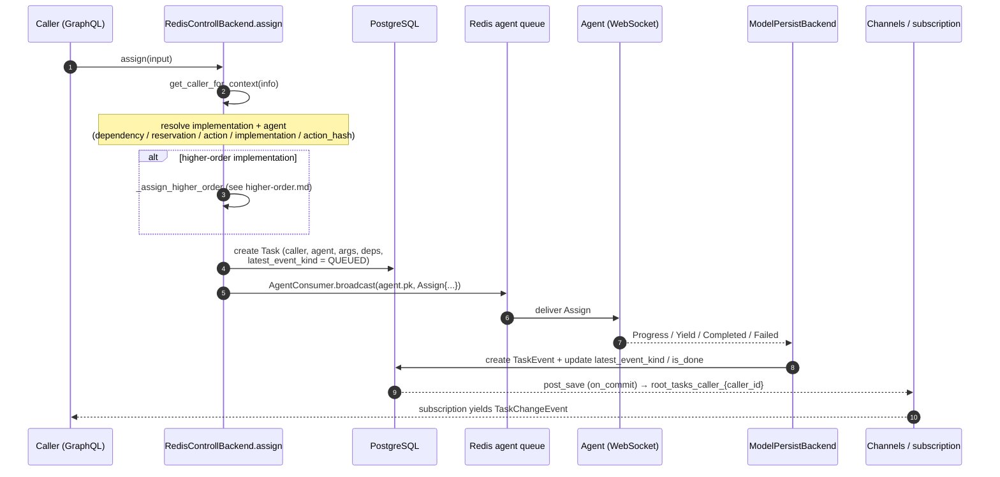
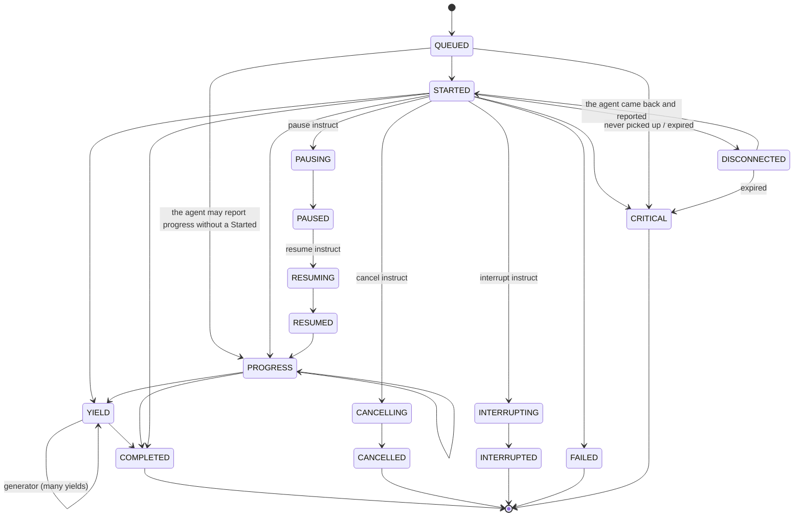

# Task Lifecycle: assign / events

An **Task** is the record of one task execution. This document traces its life: how `assign`
resolves an implementation and agent, how the work reaches the agent, how the agent's events are
persisted and fanned back to the caller, and the event state machine that governs it all. The
orchestration lives in `facade/backend.py` (`RedisControllBackend`) and `facade/persist_backend.py`
(`ModelPersistBackend`).

## The assign flow end to end



## Step 1 — identify the caller

Every `assign` begins with `get_caller_for_context(info)`, which `get_or_create`s the
`Caller` for the request's `(client, user, organization)` (see [identity.md](identity.md)). That
caller is stamped on the Task and is the key the caller later subscribes on.

## Step 2 — resolve implementation and agent

`RedisControllBackend.assign` accepts several mutually-exclusive routing inputs and resolves an
`implementation` + `agent` from whichever is set (checked in this order):

| Input | Resolution |
| --- | --- |
| `input.dependency` (+ `method`, `parent`) | Look up the parent task's resolved `dependencies`, pick a random agent for that dependency key, and take the implementation for `method`. |
| `input.reservation` | Pick a random implementation from the reservation's pool; use its agent. |
| `input.action` | Pick the first implementation whose agent is live — `connected` **and** `last_seen > now - AGENT_STALE_AFTER` (`facade.liveness`, the same window the reconnect gate and the stale sweep use). |
| `input.implementation` | Use the implementation directly. For a normal (non higher-order) implementation, assert the agent is connected and recently seen. |
| `input.action_hash` | Resolve the action by `hash` within the org, then a connected implementation. |

If the resolved implementation is **higher-order** (`higher_order_for_id is not None`), assign
delegates to `_assign_higher_order` and returns — that path is described in
[higher-order.md](higher-order.md). The agent of a higher-order wrapper need not be connected; only
the resolved *lower* agent matters.

## Step 3 — resolve dependencies

Unless the dependency dict came pre-resolved from a parent, `build_dependency_dict` walks the
implementation's `Dependency` rows:

- **auto-resolvable / auto_resolve overwrite** — find connected agents matching `app_filter`
  (recently seen, in the request's org), clamped to `min`/`max_viable_instances` (raising if too
  few).
- **explicit overwrite** — restrict to the caller-supplied `mapped_agents`, same viability checks.
- a non-auto-resolvable dependency with no overwrite is an error.

The result is a nested dict `{dep_key: [{agent, actions: {key: {implementation, dependencies}}}]}`
stored on `Task.dependencies`, ready for the agent to fan out child tasks against.

## Step 4 — persist and broadcast

`assign` creates the `Task` (with `latest_event_kind = QUEUED`,
`latest_instruct_kind = ASSIGN`, `caller`, `agent`, `args`, `acted_on`, resolved `dependencies`,
`capture` flag) and then broadcasts the work:

```python
AgentConsumer.broadcast(
    task.agent.pk,
    message=messages.Assign(
        task=str(task.pk),
        args=input.args,
        user=str(info.context.request.user.sub),
        app=str(info.context.request.client.client_id),
        org=...,
        interface=implementation.interface,
        action=str(implementation.action.hash),
        ...
    ),
)
```

`broadcast` pushes onto the Redis **agent queue** (not the Channels layer) so a message survives if
the agent is momentarily offline — see [agent-protocol.md](agent-protocol.md). Any `INIT` lifecycle
hooks on the input are recursively assigned as child tasks.

## Step 5 — the agent reports, the server persists

The agent streams events back over its socket; `ModelPersistBackend` handles each
(`facade/persist_backend.py`):

| Agent message | Persisted as | Side effects |
| --- | --- | --- |
| `Started` | `TaskEvent(STARTED)` | moves `latest_event_kind` off `QUEUED` |
| `Progress` | `TaskEvent(PROGRESS, progress, message)` | re-arms the progress lease (physical work) |
| `Log` | `TaskEvent(LOG, message, level)` | — |
| `Yield` | `TaskEvent(YIELD, returns)` | unfold to higher-order wrapper |
| `Paused` / `Resumed` | `TaskEvent(PAUSED/RESUMED)` | confirms a pause/resume instruct |
| `Completed` | `TaskEvent(COMPLETED)` | terminal (`is_done`, `finished_at`) + unfold |
| `Cancelled` | `TaskEvent(CANCELLED)` | terminal + unfold |
| `Interrupted` | `TaskEvent(INTERRUPTED)` | terminal + unfold |
| `Failed` | `TaskEvent(FAILED, message)` | terminal + unfold |
| `Critical` | `TaskEvent(CRITICAL, message)` | terminal + unfold |

Terminal events set `is_done = True` and stamp `finished_at`. Every terminal — and `YIELD` — also
calls `_unfold_to_higher_order`, so a wrapper task sees a mapped event when its child finishes (see
[higher-order.md](higher-order.md)).

Note what is **not** in the middle column: `Progress`, `Log` and `Yield` write a `TaskEvent` but
never move `Task.latest_event_kind`. A healthy, actively reporting task therefore still reads
`QUEUED` — which is why "has an agent picked this up?" is answered by `Task.picked_up_at`, stamped
on the first report of any kind, and not by the denormalized kind.

## Step 6 — fan back to the caller

Creating an `TaskEvent` (and the Task itself) fires Django `post_save` signals that
broadcast to the caller's realtime topics. Root-task changes go to
`root_tasks_caller_{caller_id}` (and `root_tasks_org_{org_id}`), which is what the `myTasks` /
`tasks` subscriptions listen on; every caller event, root or child, is also mirrored to
`task_caller_{caller_id}`, which an agent socket consumes to receive results for work it
originated. The full channel/signal/subscription mechanism is [realtime.md](realtime.md).

## The event state machine

`TaskEvent.kind` (enum `TaskEventKind`, `facade/enums/task.py`) records each
transition; `Task.latest_event_kind` denormalizes the current one for fast reads.



- `QUEUED` → `STARTED` is the path to a running task; `LOG` and `PROGRESS` are non-terminal
  annotations along the way and do not move `latest_event_kind` (see the note above).
- `YIELD` carries returns — a `FUNCTION` yields once, a `GENERATOR` many times.
- Terminal kinds: `COMPLETED`, `CANCELLED`, `INTERRUPTED`, `FAILED`, `CRITICAL`.
- `BOUND`, `DELEGATE` and `UNASSIGN` exist in `TaskEventKind` but no server code writes them; they
  are retained for historical rows and protocol symmetry, and `DELEGATE`/`BOUND` are still *read* by
  the caller-event mirrors. Do not expect them in a new task's history.
- `DISCONNECTED` (the agent dropped mid-task; "fate unknown") is **not** terminal by itself: the
  task stays open (`is_done=False`) so a returning agent can still report the real outcome — any
  report reclaims it to `STARTED`, a terminal report finalizes it. If nothing is heard within
  `disconnected_expiry` the server finalizes it as `CRITICAL`. No state is open-ended: see
  *Deadlines* below.

## Instructing a running task

A caller steers in-flight work with **instructs** (`TaskInstructKind`): `ASSIGN`, `CANCEL`, `PAUSE`,
`RESUME`, `INTERRUPT`, `COLLECT`. Each backend method (`cancel`, `interrupt`, `pause`, `resume`)
sets `Task.latest_instruct_kind` and broadcasts the corresponding `messages.*` to the agent.

Only `interrupt` **forwards to descendants** (`propagate_children=True`) — reaching the lower task a
higher-order wrapper delegated to, possibly on another agent. `cancel` targets the mother alone and
relies on the actor to wind its own children down. Stepping is carried on `resume(step=True)` and on
the `step` flag of an assign; there is no `STEP` instruct kind and no `step` mutation.

## Disconnect handling

When an agent drops, `on_agent_disconnected` (guarded by `active_connection_id`, see
[agent-protocol.md](agent-protocol.md)) marks every still-running task **owned by that agent**
(`agent_id=…, is_done=False`) with a `DISCONNECTED` event. The filter is on the **direct `agent`
FK** deliberately — a task may have a null/reassigned `implementation`, so filtering through
`implementation__agent` would silently skip work the agent actually owns.

Work the agent had **not picked up yet** (`QUEUED`, no report) is not orphaned by a disconnect —
its Assign is still in the agent's queue — and is left alone; it simply runs when the agent is
back, and expires like `DISCONNECTED` work if it never is.

## Deadlines — nothing waits forever

Every non-terminal state has a server-side deadline. None is a timer: each starts at a DB column
and is enforced by the reaper loop inside every backend (`facade/reaper.py`), so deadlines survive
restarts and any number of backends can enforce them concurrently (row-locked claims, one winner).

| waiting on | deadline starts at | setting | outcome |
|---|---|---|---|
| a live agent to report on a dispatched task | `Task.dispatched_at` | `pickup_deadline` | redelivered once, then `CRITICAL` |
| a disconnected agent to come back (grace) | `Agent.last_seen` | `grace_default` | retry axis: `CRITICAL` / re-`QUEUED` / `DISCONNECTED` |
| a `DISCONNECTED` task's real outcome | last `TaskEvent` | `disconnected_expiry` | `CRITICAL` |
| undelivered work of an agent that is gone | `Task.dispatched_at` | `disconnected_expiry` | `CRITICAL` |
| a cancel to be confirmed | `Task.interrupt_at` | `auto_interrupt` / `control_deadline` | escalated to interrupt |
| an interrupt to be confirmed | `Task.interrupt_at` | `control_deadline` | `INTERRUPTED` |
| a physical op's next progress | `Task.last_progress_at` | `progress_lease` | `CRITICAL` |

## Idempotency is a database guarantee

`assign` dedupes on the caller-supplied `reference`, and `Task` carries
`UniqueConstraint(caller, reference)` to make that true under concurrency. The
`filter(caller, reference).first()` ahead of the insert is only a fast path: two retries of one
assign can reach two backends at the same instant and both read "absent". The constraint lets
exactly one insert through; the loser catches `IntegrityError`, returns the winner's task with
`created=False`, and dispatches nothing and runs no init hooks — otherwise the work would be sent
to the agent twice, which for `effect:physical` work is the worst outcome in the system. Dispatch
itself is deferred with `transaction.on_commit`, so no agent can report on a task other
connections cannot see yet.

`Task.revision` is bumped by every write to the row (in `Task.save`, as `F("revision") + 1`) and
carried in the change feeds. Changes are produced by several backends and the channel layer does
not deliver in commit order, so a consumer must discard any `TaskChange` whose revision is not
greater than the one it already applied. `updated_at` cannot serve that purpose — `auto_now` is
skipped whenever `update_fields` omits it, which is how almost every task write is made.

## Roots, lineage and idempotency

A GraphQL `assign` is a ROOT by definition — the schema no longer exposes
`parent`/`dependency`/`method`; children are created only over the agent socket
(`AssignRequest`, where `parent` is mandatory) and by server-internal paths (init
hooks). Every child's `root` is set at creation (backfilled by migration 0015), so
interrupt propagation, the root-scoped change feeds and `myTasks` see the true tree.
`assign` is idempotent on `(caller, reference)`: re-sending a caller-supplied reference
returns the prior task without re-broadcasting — the same contract the socket path
always had.

## Retention

Terminal root task trees older than `TASK_RETENTION_SECONDS` are deleted by the
retention sweep (`facade/retention.py`, driven by the reaper loop); trees with any live member are skipped. Default 0 =
disabled — deletion also removes runs from replay discovery, so it is an explicit
operator opt-in. Control ops (cancel/interrupt/pause/resume) write a `TaskInstruct`
audit row naming the requesting caller.

## Ephemeral work is a Probe, not a Task

Work that should leave no history is not a Task at all — it is an **ephemeral Probe**
(`facade/probes/`): the `probe` GraphQL mutation dispatches the same `Assign` wire message
under a `p-…` id, all server state lives in redis under a TTL, and no Task/TaskEvent rows
are ever written. Probes trade every Task guarantee (crash recovery, replay, locks, DB
provenance lineage) for latency and zero storage — built for hover-frequency interactive
work. Two contracts keep the concepts honest: the action author must declare
`allow_probe` on the definition (a non-identity-bearing qualifier like
`pure`/`idempotent` — the `probe` mutation refuses undeclared actions), and the `Assign`
wire message carries `probe: true` so the agent knows it is running a probe (no
history, no sub-assignment, no locks) rather than a task. The legacy
`AssignInput.ephemeral` flag has been removed; the `Task.ephemeral` column remains only
to exclude old rows from replay offers. `capture` independently controls whether
logs/events are retained for debugging.
