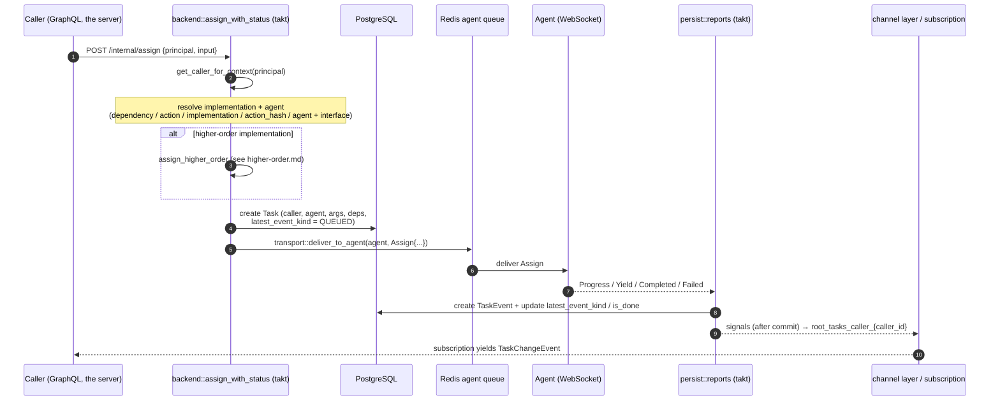
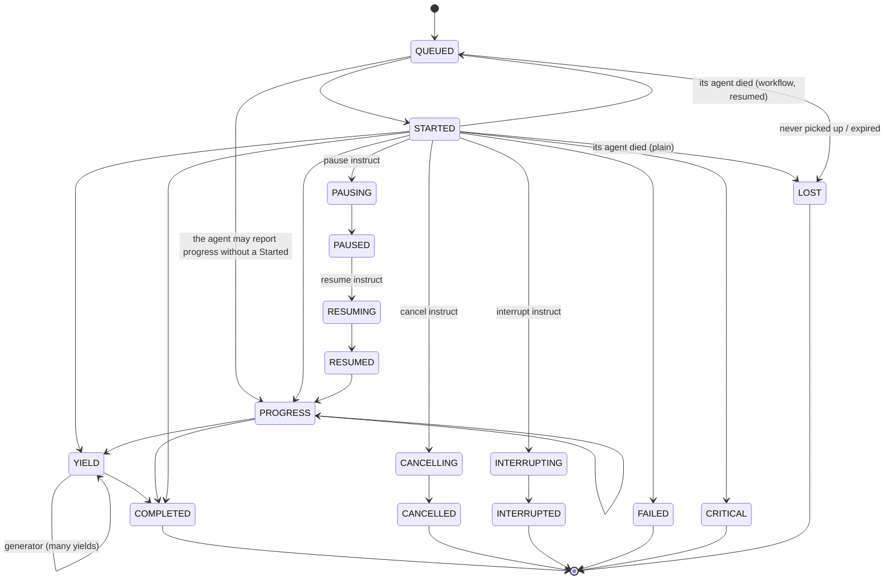

# Task Lifecycle: assign / events

> Code references are to takt's `facade` crate, `takt/crates/facade/src/`, unless a path
> says otherwise.

A **Task** is the record of one task execution. This document traces its life: how `assign`
resolves an implementation and agent, how the work reaches the agent, how the agent's events are
persisted and fanned back to the caller, and the event state machine that governs it all.

All of it runs in takt. The orchestration is `backend.rs` (`assign_with_status`, the lifecycle
controls) and `persist/` (`reports.rs` for what an agent reports, `transitions.rs` for the task
state machine, `reconcile.rs` for the sweeps). A GraphQL `assign` reaches it through the internal
API: the server's mutation calls `POST /internal/assign` (`facade/takt.py` in the server) with
the request's identity as the `principal`, and reads the created task back from the database.

## The assign flow end to end



## Step 1 — identify the caller

Every `assign` begins with `get_caller_for_context`, which gets or creates the
`Caller` for the principal's `(client, user, organization)` (see
[identity.md](../../docs/design/identity.md)). That
caller is stamped on the Task and is the key the caller later subscribes on.

## Step 2 — resolve implementation and agent

`assign_with_status` accepts several mutually-exclusive routing inputs and resolves an
`implementation` + `agent` from whichever is set (checked in this order):

| Input | Resolution |
| --- | --- |
| `input.dependency` (+ `method`, `parent`) | Look up the parent task's resolved `dependencies` (a frozen snapshot: a dependency keeps hitting the peer chosen when the parent was assigned) and take the implementation for `method` (`resolve_dependency_target`). |
| `input.action` | Pick an implementation whose agent is available: live — `connected` **and** a heartbeat within the stale window (`liveness.rs`, the same window the reconnect gate and the stale sweep use). |
| `input.implementation` | Use the implementation directly. For a normal (non higher-order) implementation, its agent must be available. |
| `input.action_hash` | Resolve the action by `hash` within the org, then an available implementation. |
| `input.agent` + `input.interface` | The implementation with that interface on that agent; its agent must be available. |

If the resolved implementation is **higher-order** (`higher_order_for_id` is set), assign
delegates to `assign_higher_order` and returns — that path is described in
[higher-order.md](../../docs/design/higher-order.md). The availability of a wrapper is the
availability of the agent of the implementation it wraps.

The args are validated against the action's ports before anything is created.

## Step 3 — resolve dependencies

Unless the dependency dict came pre-resolved from a parent, `build_dependency_dict` walks the
implementation's `Dependency` rows:

- **auto-resolvable / auto_resolve overwrite** — find connected agents matching `app_filter`
  (recently seen, in the request's org), clamped to `min`/`max_viable_instances` (raising if too
  few). Without an `app_filter` there is nothing to resolve by: the dependency is unbound.
- **explicit overwrite** — restrict to the caller-supplied `mapped_agents` (of the request's
  org), same viability checks.
- a non-auto-resolvable dependency with no overwrite is an error, unless it is `optional`: an
  optional dependency nobody answers stays unbound (`[]`).

A bound implementation may have dependencies of its own. They are resolved the same way, right
here, one level below it, and so on down: **the whole tree is resolved at the root assign.**

- Overwrites are per level. A dependency key is a parameter name and repeats across levels, so
  the overwrites for a level below sit under the agent they are for
  (`mapped_agents[].dependencies`), and the root's list never reaches down.
- A **cycle** (an implementation reached again on its own path) is refused: an actor runs one
  call at a time by default and would wait on itself. A tree deeper than
  `rekuest.dependency_max_depth` is refused.
- A higher-order wrapper with dependencies of its own cannot be bound below the root.
- Anything unmet anywhere in the tree refuses the assign.

The result is a nested dict `{dep_key: [{agent, actions: {key: {implementation, dependencies}}}]}`
stored on `Task.dependencies`, where each `dependencies` is the bound implementation's own
level. A child assigned through `dependency` + `method` takes its target from its parent's
dict and is given that target's `dependencies` as its own: every task carries exactly its
subtree, frozen when the root was assigned.

`POST /internal/resolve` (GraphQL `dependencyTree`) runs the same resolution without
assigning. Instead of refusing it notes on each node why it is unmet and goes on, so a UI can
show the tree and what is still to pin.

## Step 4 — persist and broadcast

`assign` creates the `Task` (with `latest_event_kind = QUEUED`,
`latest_instruct_kind = ASSIGN`, `caller`, `agent`, `args`, `acted_on`, resolved `dependencies`,
`capture` flag), mints its provenance token in the same transaction, and once the row is
committed hands the work to the agent:

```rust
dispatch(ctx, task, agent, Assign {
    task, args, interface, user, org,
    action,          // the action's hash
    implementation,
    token,           // the provenance token, see provenance.md
    ..
})
```

`dispatch` calls `transport::deliver_to_agent`, which pushes onto the Redis **agent queue** (not
the channel layer) so a message survives if the agent is momentarily offline — see
[agent-protocol.md](agent-protocol.md) — or, for a WEBHOOK agent, POSTs it signed. Any `INIT`
lifecycle hooks on the input are assigned as child tasks.

A task with a future `not_before` (a schedule's next run, a delayed assign) is created but not
dispatched; the `due tasks` sweep dispatches it when it is due.

## Step 5 — the agent reports, the server persists

The agent streams events back over its socket; `persist::reports::on_report` handles each
(`persist/reports.rs`), through the row-locked claim of `persist/transitions.rs`:

| Agent message | Persisted as | Side effects |
| --- | --- | --- |
| `Started` | `TaskEvent(STARTED)` | moves `latest_event_kind` off `QUEUED` |
| `Progress` | `TaskEvent(PROGRESS, progress, message)` | |
| `Log` | `TaskEvent(LOG, message, level)` | — |
| `Yield` | `TaskEvent(YIELD, returns)` | unfold to higher-order wrapper |
| `Paused` / `Resumed` | `TaskEvent(PAUSED/RESUMED)` | confirms a pause/resume instruct |
| `Completed` | `TaskEvent(COMPLETED)` | terminal (`is_done`, `finished_at`) + unfold |
| `Cancelled` | `TaskEvent(CANCELLED)` | terminal + unfold |
| `Interrupted` | `TaskEvent(INTERRUPTED)` | terminal + unfold |
| `Failed` | `TaskEvent(FAILED, message)` | terminal + unfold |
| `Critical` | `TaskEvent(CRITICAL, message)` | terminal + unfold |

Terminal events set `is_done = True` and stamp `finished_at`. Every terminal — and `YIELD` — also
calls `unfold_to_higher_order`, so a wrapper task sees a mapped event when its child finishes (see
[higher-order.md](../../docs/design/higher-order.md)).

Note what is **not** in the middle column: `Progress`, `Log` and `Yield` write a `TaskEvent` but
never move `Task.latest_event_kind`. A healthy, actively reporting task therefore still reads
`QUEUED` — which is why "has an agent picked this up?" is answered by `Task.picked_up_at`, stamped
on the first report of any kind, and not by the denormalized kind.

## Step 6 — fan back to the caller

Creating a `TaskEvent` (and the Task itself) is published, after the commit, to the caller's
realtime topics (`signals.rs`: `task_saved`, `task_event_created`), on the same `channels_redis`
layer the server's GraphQL subscriptions listen on. Root-task changes go to
`root_tasks_caller_{caller_id}` (and `root_tasks_org_{org_id}`), which is what the `myTasks` /
`tasks` subscriptions listen on; every caller event, root or child, is also mirrored to
`task_caller_{caller_id}`, which an agent socket consumes to receive results for work it
originated. The full channel/signal/subscription mechanism is
[realtime.md](../../docs/design/realtime.md).

## The event state machine

`TaskEvent.kind` (enum `TaskEventKind`, `facade/enums/task.py` in the server) records each
transition; `Task.latest_event_kind` denormalizes the current one for fast reads.



- `QUEUED` → `STARTED` is the path to a running task; `LOG` and `PROGRESS` are non-terminal
  annotations along the way and do not move `latest_event_kind` (see the note above).
- `YIELD` carries returns — a `FUNCTION` yields once, a `GENERATOR` many times.
- Terminal kinds: `COMPLETED`, `CANCELLED`, `INTERRUPTED`, `FAILED`, `CRITICAL`, `LOST`.
- `BOUND`, `DELEGATE` and `UNASSIGN` exist in `TaskEventKind` but no server code writes them; they
  are retained for historical rows and protocol symmetry, and `DELEGATE`/`BOUND` are still *read* by
  the caller-event mirrors. Do not expect them in a new task's history.
- `LOST` (its agent died while it ran; how it ended is unknown) is terminal, and final: a later
  report from the agent is kept as `LATE_REPORT`. A workflow is resumed instead (see
  [workflows.md](workflows.md)).

## Instructing a running task

A caller steers in-flight work with **instructs** (`TaskInstructKind`): `ASSIGN`, `CANCEL`, `PAUSE`,
`RESUME`, `INTERRUPT`, `COLLECT`. Each control (`request_control` and `interrupt` in
`backend.rs`, behind the internal routes `cancel`, `interrupt`, `pause` and `resume`) sets
`Task.latest_instruct_kind`,
writes a `TaskInstruct` row and delivers the corresponding message to the agent.

Only `interrupt` **forwards to descendants** — reaching the lower task a
higher-order wrapper delegated to, possibly on another agent. `cancel` targets the mother alone and
relies on the actor to wind its own children down. Stepping is carried on `resume(step=True)` and on
the `step` flag of an assign; there is no `STEP` instruct kind and no `step` mutation.

## Disconnect handling

When an agent drops, `on_agent_disconnected` releases its lease (guarded by
`active_connection_id`, see [agent-protocol.md](agent-protocol.md)). The `disconnected agents`
sweep then waits out the grace window; after it every still-running task **owned by that agent**
(`agent_id = …, is_done = false`) ends `LOST`, and every workflow is resumed
(`reconcile_orphaned_executor_work`). With a grace of zero that happens at once, on the
disconnect. The filter is on the **direct `agent` FK** deliberately — a task may have a
null/reassigned `implementation`, so filtering through the implementation's agent would silently
skip work the agent actually owns.

Work the agent had **not picked up yet** (`QUEUED`, no report) is not orphaned by a disconnect —
its Assign is still in the agent's queue — and is left alone; it simply runs when the agent is
back, and ends `LOST` (`started: false`) after `disconnected_expiry` if it never is.

## Deadlines — nothing waits forever

Every non-terminal state has a server-side deadline. None is a timer: each starts at a DB column
and is enforced by takt's sweep loop (`reaper.rs`), which runs inside every takt replica
every `rekuest.sweep_interval` seconds. Deadlines survive restarts, and any number of replicas
can enforce them concurrently: a tick token in redis lets one sweep per tick, and every
transition is a row-locked claim with one winner.

| waiting on | deadline starts at | setting | outcome |
|---|---|---|---|
| a live agent to report on a dispatched task | `Task.dispatched_at` | `pickup_deadline` | redelivered once, then `LOST` (`started: false`) |
| a disconnected agent to come back (grace) | `Agent.last_seen` | `grace_default` | `LOST`, or a workflow resumed |
| undelivered work of an agent that is gone | `Task.dispatched_at` | `disconnected_expiry` | `LOST` |
| a cancel to be confirmed | `Task.interrupt_at` | `auto_interrupt` / `control_deadline` | escalated to interrupt |
| an interrupt to be confirmed | `Task.interrupt_at` | `control_deadline` | `INTERRUPTED` |
| a delayed task to become due | `Task.not_before` | (the task's own) | dispatched |

### The sweeps

One tick runs these in order (`reaper::SWEEPS`). Agents come before tasks: healing a
stuck-connected agent is what makes its work visible to the task sweeps of the same tick.

| sweep | function | what it does |
|---|---|---|
| stale agents | `reconcile::reconcile_stale_agents` | revokes the lease of an agent stuck `connected` past the stale window |
| disconnected agents | `reconcile::reconcile_disconnected_agents` | after the grace window, ends a gone agent's running tasks `LOST` and resumes its workflows |
| schedules | `schedules::refill_schedules` | gives every enabled schedule that is due one its next run, as a delayed task |
| triggers | `triggers::fire_triggers` | claims unprocessed signals, assigns every applying trigger's action and logs what became of each listening trigger |
| due tasks | `reconcile::dispatch_due_tasks` | dispatches tasks whose `not_before` has passed |
| unpicked tasks | `reconcile::reconcile_unpicked_tasks` | redelivers once, then ends `LOST`, a task its live agent never reported on |
| due controls | `reconcile::escalate_due_controls` | escalates an unconfirmed cancel to an interrupt, finalizes an unconfirmed interrupt |
| expired tasks | `reconcile::expire_disconnected_tasks` | ends `LOST` the undelivered work of an agent that never came back |

Schedules and triggers run before the due tasks, so a run a schedule is given or a signal fires
this tick is dispatched by the same tick when it is already due.

Retention (`retention::sweep`) runs on every 60th tick: see [Retention](#retention).

A replica whose clock is off the database's by more than the tolerated skew skips its sweeps
(`clock.rs`): every sweep decides whether an agent is dead by comparing timestamps, so a skewed
clock makes a wrong decision, not a late one.

### Schedules and triggers

Nothing creates a schedule or a trigger by itself: they are an organization's own automation,
written one by one or imported as a wiregram (the server's `facade/wiregrams.py`).

A **schedule** always has exactly one waiting run while it is enabled and has not ended. The
server owns the schedule rows (GraphQL create, update, delete); takt plans the runs
(`schedules.rs`) and is the only reader of cron lines (`timing.rs`). The server asks through the
internal API to validate a timing (`schedule/validate`), to plan after a change
(`schedule/plan`), to drop the waiting run (`schedule/cancel-waiting`), to run now
(`schedule/trigger`) and for a timing's next slots (`schedule/upcoming`).

- A timing is an interval in seconds, aligned to the schedule's creation, or a five-field cron
  line read in the schedule's time zone.
- A slot in the hour a daylight-saving change skips runs at the first instant after it. A
  fixed-time job in the repeated hour of a fall-back night runs once.
- Six-field lines and wrapping ranges such as `5-1` are refused.
- A run's reference is `schedule:<id>:<slot>`, unique per caller, so two replicas planning the
  same schedule create one run.
- **Overlap.** `SKIP` (the default): the next run is planned once the previous one finished, so
  runs never overlap. `ALLOW`: it is planned as soon as the previous one was handed over. A run
  is *waiting* while it has not been handed over (`dispatch_attempts = 0`); there is never more
  than one.
- **Catch-up.** Off (the default): the next slot is the first after now, so slots that passed
  while takt was down or a run was open are skipped. On: it is the first after the slot planned
  last (`last_slot_at`), so missed slots run late, one after another; a missed slot is due, so
  its run is handed over at once. A gap of more than 100 slots is not caught up.
- **An end.** At `ends_at`, or once `max_runs` runs were created (`run_count`), nothing more is
  planned. Nothing is written to say so; the columns say it.

A **trigger** assigns an action when a matching signal arrives. A hub service POSTs a signal to
`/agi/signal/{service}` (`signal_intake.rs`); it is stored and acknowledged at once. The
`triggers` sweep looks at every enabled trigger of the signal's organization that listens for
its kind and structure, and writes one `facade_firing` row for each:

- `FIRED`, with the run, when the signal satisfies the trigger's conditions and the target
  port's own `requires`, and no policy holds it back;
- `REJECTED`, with the reason, when the signal does not satisfy it, the trigger has ended
  (`ends_at`, `max_runs`), or it is debounced (`debounce_seconds`: it already fired for this
  object within the window; the first signal fires, later ones are rejected);
- `FAILED`, with the reason, when the run could not be created, or the chain of triggers is
  deeper than `rekuest.trigger_max_depth`. Only this counts against the trigger
  (`consecutive_failures`, `last_error`).

A signal nobody listens for has no firing at all. Each trigger and signal pair runs at most once
(`trigger:<id>:<signal>`). Trigger rows are locked while their policies are checked, so two
replicas working on two signals cannot both pass a debounce or a run limit. A firing lives as
long as its signal; a run deleted earlier leaves its firing with no task.

`trigger/fire` **replays** a trigger on a stored signal: the run is created whatever the
signal's descriptors and the trigger's policies say, as a root run of the trigger's owner, and
logged as a firing of its own (`replay`).

takt publishes what it writes: a signal arriving and being processed on `signal_feed`
(`signals_org_<org>`), a rule's bookkeeping on `rule_feed` (`rules_org_<org>`). The server
publishes its own writes to rules on the same channel.

## Idempotency is a database guarantee

`assign` dedupes on the caller-supplied `reference`, and `Task` carries
`UniqueConstraint(caller, reference)` to make that true under concurrency. The
lookup ahead of the insert is only a fast path: two retries of one
assign can reach two replicas at the same instant and both read "absent". The constraint lets
exactly one insert through; the loser gets the unique violation, returns the winner's task with
`created = false`, and dispatches nothing and runs no init hooks — otherwise the work would be sent
to the agent twice, which for `IRREVERSIBLE` work is the worst outcome in the system. Dispatch
happens only after the commit, so no agent can report on a task other connections cannot see yet.

`Task.revision` is bumped by every write to the row and carried in the change feeds. Changes are
produced by several replicas and the channel layer does not deliver in commit order, so a
consumer must discard any `TaskChange` whose revision is not greater than the one it already
applied.

## Roots, lineage and idempotency

A GraphQL `assign` is a ROOT by definition — the schema does not expose
`parent`/`dependency`/`method`; children are created only over the agent socket
(`AssignRequest`, where `parent` is mandatory) and by server-internal paths (init
hooks, a trigger fired by a task's signal). Every child's `root` is set at creation, so
interrupt propagation, the root-scoped change feeds and `myTasks` see the true tree.
`assign` is idempotent on `(caller, reference)`: re-sending a caller-supplied reference
returns the prior task without dispatching it again, on GraphQL and on the socket alike.

## Retention

Retention is an takt sweep (`retention.rs`), run on every 60th tick, one batch at a time:

- Terminal root task trees older than `rekuest.task_retention` are deleted with their events,
  instructs and patches; trees with any member that is not done are skipped. The default, `0`,
  disables it — deletion also removes runs from replay discovery, so it is an explicit operator
  opt-in.
- Terminal *ephemeral* trees (the runs of a schedule with `ephemeral_runs`) have their own,
  shorter horizon, `rekuest.ephemeral_task_retention`, which is on by default.
- Processed signals older than `rekuest.signal_retention` are deleted; the runs they caused
  keep their tasks.

Control ops (cancel/interrupt/pause/resume) write a `TaskInstruct` audit row naming the
requesting caller.

## Ephemeral work is a Probe, not a Task

Work that should leave no history is not a Task at all — it is an **ephemeral Probe**
(`probes/`): the `probe` GraphQL mutation (internal route `probe`) dispatches the same `Assign` wire message
under a `p-…` id, all server state lives in redis under a TTL, and no Task/TaskEvent rows
are ever written. Probes trade every Task guarantee (crash recovery, replay, locks, DB
provenance lineage) for latency and zero storage — built for hover-frequency interactive
work. Two contracts keep the concepts honest: the action author must declare
`allow_probe` on the definition (a non-identity-bearing qualifier like
`pure`/`idempotent` — the `probe` mutation refuses undeclared actions), and the `Assign`
wire message carries `probe: true` so the agent knows it is running a probe (no
history, no sub-assignment, no locks) rather than a task. `Task.ephemeral` is something else:
it marks a schedule's housekeeping runs, which are real tasks with a short retention.
`capture` independently controls whether logs/events are retained for debugging.
